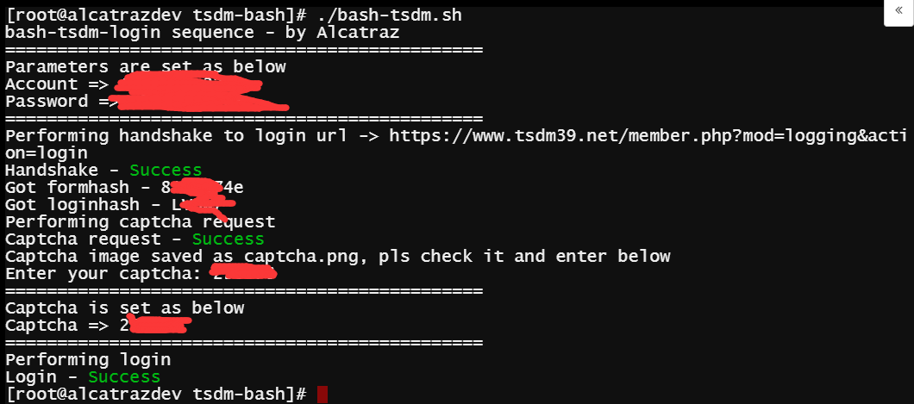
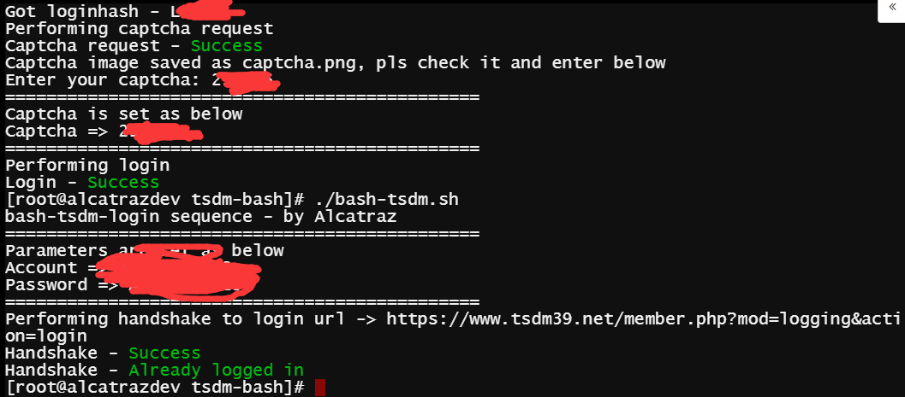
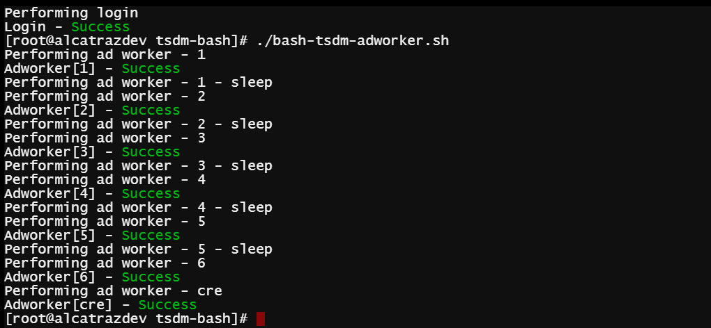
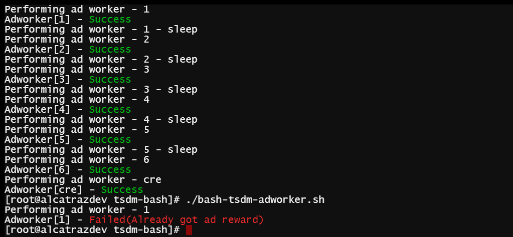
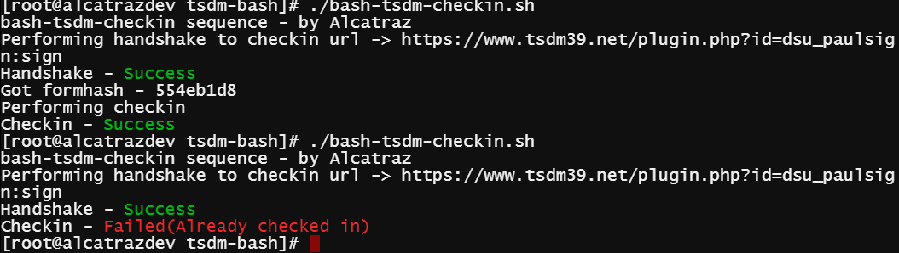

# bash-tsdm #

### Intro/简介 ###
Scripts for tsdm, purely based on bash

天使动漫纯bash脚本

cookies.txt has been ignored, feel free to use and contribute safely

cookies.txt已被git自动屏蔽，欢迎有能力的提出更多commit

### Setup/使用 ###
```bash

# Initialize local repository
git clone https://github.com/Alcatraz323/bash-tsdm

```
 - 找到bash-tsdm-login.sh,填上你的账号密码
```bash

# Login
cd bash-tsdm
chmod 0755 *.sh

# Login your account and save cookie.txt
# captcha is saved in the working folder as captcha.png,
# you need to check and enter the captcha manually to login
./bash-tsdm-login.sh

# Then you may run...
./bash-tsdm-checkin.sh
./bash-tsdm-adworker.sh
# manually or by crond
```
### Screenshots/截图 ###




